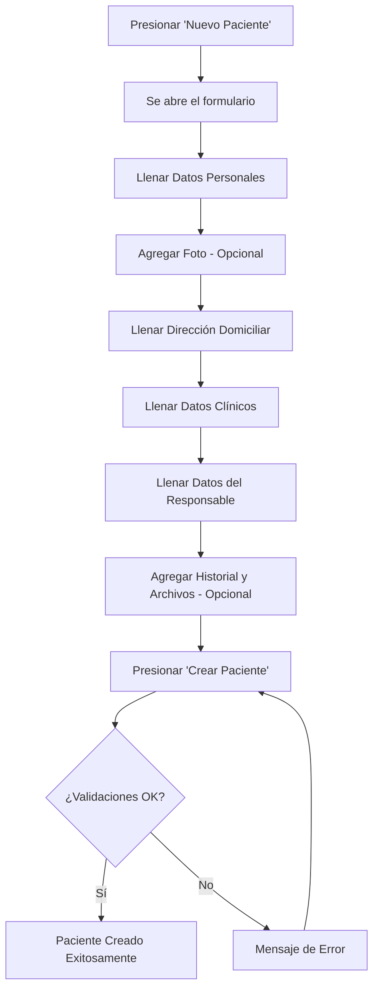

# Manual de Usuario — Creación de Paciente

## Sistema Humana — Clínica Asociación Humana

---

## 1. Acceso al Formulario de Registro

Para crear un nuevo paciente en el sistema, el usuario debe hacer clic en el botón **"Nuevo Paciente"** disponible en la vista de Pacientes o al momento de agendar una cita.

> 📸 **IMAGEN 1:** Captura de pantalla mostrando el botón "Nuevo Paciente" en la interfaz principal.

Al presionar este botón, se abrirá un modal (ventana emergente) con el título **"Nuevo Paciente"**.

> 📸 **IMAGEN 2:** Captura del modal de Nuevo Paciente recién abierto, mostrando el formulario vacío.

---

## 2. Datos Personales

Esta es la primera sección del formulario. Aquí se ingresa la información básica del paciente.

| Campo | Tipo | ¿Obligatorio? | Descripción |
|-------|------|:---:|-------------|
| **Nombre del Paciente** | Texto | ✅ Sí | Nombre completo del paciente |
| **DPI** | Texto | No | Documento Personal de Identificación |
| **Código Facturación** | Texto | No | Código para facturación |
| **Ocupación** | Texto | No | A qué se dedica el paciente |
| **Teléfono del Paciente** | Numérico | ✅ Sí | Solo acepta números (ej: 55555555) |
| **Email del Paciente** | Email | No | Correo electrónico del paciente |
| **Edad** | Numérico | No | Se calcula automáticamente si se ingresa la fecha de nacimiento |
| **Fecha Nacimiento** | Fecha | No | Se calcula automáticamente si se ingresa la edad |
| **Género** | Selección | No | Masculino o Femenino (por defecto: Masculino) |

> [!TIP]
> Los campos de **Edad** y **Fecha de Nacimiento** están sincronizados: al ingresar uno, el otro se calcula automáticamente.

> 📸 **IMAGEN 3:** Captura de la sección "Datos Personales" con algunos campos llenos de ejemplo.

---

## 3. Foto del Paciente

Debajo de los datos personales hay una sección para agregar la fotografía del paciente. Existen dos opciones:

1. **Abrir cámara:** Activa la cámara web del dispositivo para tomar una foto en vivo del paciente. Al presionar **"Tomar foto"**, la imagen se captura y se muestra como vista previa.
2. **Subir foto:** Permite seleccionar una imagen existente desde el equipo.

Si ya hay una foto, aparece un botón para **"Quitar foto"** en caso de querer eliminarla.

> 📸 **IMAGEN 4:** Captura de la sección de foto del paciente, mostrando los botones "Abrir cámara" y "Subir foto".

---

## 4. Dirección Domiciliar

En esta sección se registra la dirección del paciente. Los campos se despliegan dinámicamente según la selección:

| Campo | Tipo | Condición |
|-------|------|-----------|
| **País** | Selección | Siempre visible. Por defecto: Guatemala |
| **Departamento** | Selección | Solo si el país es Guatemala |
| **Municipio** | Selección | Solo si se seleccionó un departamento |
| **Zona** | Selección | Solo si el departamento es Guatemala y el municipio tiene zonas |

> [!NOTE]
> Los municipios se cargan automáticamente según el departamento seleccionado. Las zonas solo aparecen para municipios del departamento de Guatemala que tengan zonas definidas.

> 📸 **IMAGEN 5:** Captura de la sección "Dirección Domiciliar" con un departamento y municipio seleccionados.

---

## 5. Datos Clínicos

Esta sección registra información sobre la procedencia médica del paciente.

| Campo | Tipo | Opciones |
|-------|------|----------|
| **Procedencia** | Selección | Humana, Hospital |
| **Médico Tratante Anterior** | Selección | No ha estado en tratamiento, IGSS, Médico Privado, Hospital Nacional |
| **Detalle IGSS** | Selección | Solo aparece si se selecciona "IGSS". Opciones: IGSS consulta privada, IGSS exámenes de diagnóstico, Servicio Contratado |
| **Canal de referencia** | Selección | ¿De dónde nos conoció? — Conocido, Email, Facebook, Familia, Google, IA, Instagram, LinkedIn, Otros, Página Web, Radio, Televisión, TikTok, WhatsApp, YouTube |

> 📸 **IMAGEN 6:** Captura de la sección "Datos Clínicos" mostrando las opciones disponibles.

---

## 6. Datos del Responsable

Si el paciente es menor de edad o necesita un responsable, aquí se ingresa esa información.

| Campo | Tipo | Descripción |
|-------|------|-------------|
| **Checkbox:** "El paciente ve por su propia salud" | Casilla | Si se marca, los campos de responsable se desactivan y se llenan automáticamente con "No hay" |
| **Nombre Responsable** | Texto | Nombre completo del responsable |
| **Teléfono Responsable** | Numérico | Solo acepta números |
| **Email Responsable** | Email | Correo electrónico del responsable |

> [!IMPORTANT]
> Si el paciente es un **adulto que se atiende solo**, marque la casilla **"EL PACIENTE VE POR SU PROPIA SALUD"** para indicar que no tiene responsable.

> 📸 **IMAGEN 7:** Captura de la sección "Datos del Responsable" con la casilla marcada.

> 📸 **IMAGEN 8:** Captura de la sección "Datos del Responsable" sin la casilla marcada, con campos habilitados.

---

## 7. Historial Clínico y Archivos

La última sección permite agregar antecedentes médicos y archivos adjuntos.

| Campo | Tipo | Descripción |
|-------|------|-------------|
| **Antecedentes Médicos** | Cuadro de texto grande | Texto libre para anotar información médica previa del paciente |
| **Archivos Adjuntos** | Carga de archivos | Permite subir múltiples documentos (historial previo, fichas clínicas, exámenes, etc.) |

**Para subir archivos:**
1. Haga clic en el área que dice **"Click para subir archivos"**
2. Seleccione uno o varios archivos desde su computadora
3. Los archivos seleccionados aparecerán listados debajo con opción de eliminarlos individualmente antes de guardar

> 📸 **IMAGEN 9:** Captura de la sección "Historial Clínico y Archivos" mostrando el campo de antecedentes y la zona de carga de archivos.

---

## 8. Guardar el Paciente

Una vez completados todos los campos necesarios, presione el botón **"Crear Paciente"** en la esquina inferior derecha del formulario.

> 📸 **IMAGEN 10:** Captura del botón "Crear Paciente" en la parte inferior del modal.

### Validaciones al guardar:

El sistema verificará automáticamente lo siguiente antes de guardar:

| Validación | Descripción |
|------------|-------------|
| **Nombre obligatorio** | El campo "Nombre del Paciente" no puede estar vacío |
| **Teléfono obligatorio** | El campo "Teléfono del Paciente" no puede estar vacío |
| **DPI duplicado** | Si otro paciente ya tiene el mismo DPI, no se permitirá guardar |
| **Código de facturación duplicado** | Si otro paciente ya tiene el mismo código, no se permitirá guardar |
| **Nombre duplicado** | Si ya existe un paciente con el mismo nombre exacto, se mostrará una alerta |

> [!CAUTION]
> Si aparece un mensaje de error indicando que ya existe un paciente con el mismo DPI, código de facturación o nombre, verifique que no se esté duplicando un registro existente.

### Confirmación exitosa:

Si todo es correcto, aparecerá un mensaje de confirmación: **"Paciente creado exitosamente"** y el modal se cerrará automáticamente.

> 📸 **IMAGEN 11:** Captura del mensaje de éxito "Paciente creado exitosamente".

---

## Resumen Visual del Flujo

---

> **Nota:** Reemplace cada marcador `📸 IMAGEN X` con la captura de pantalla correspondiente de su sistema.
